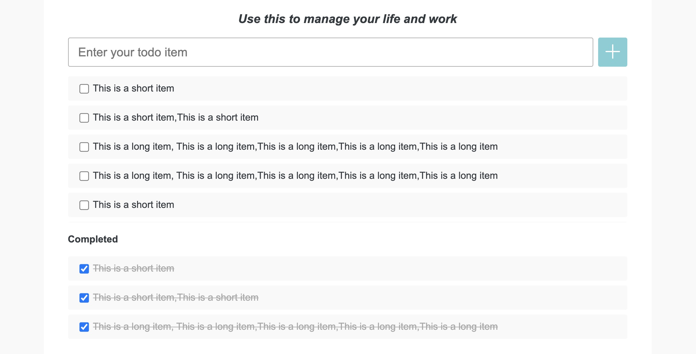
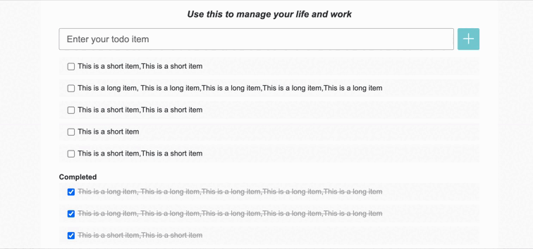
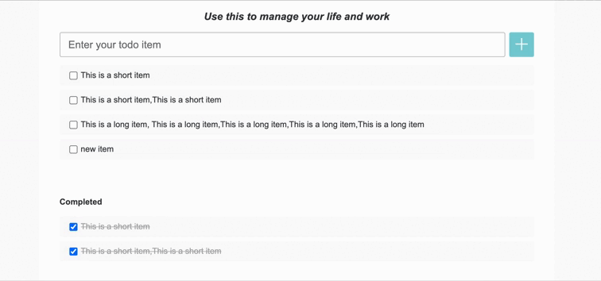
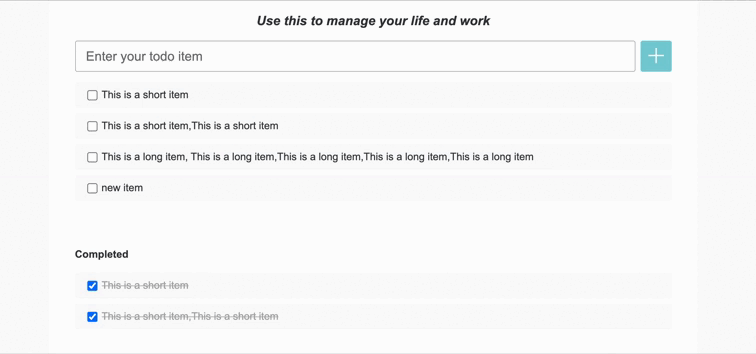
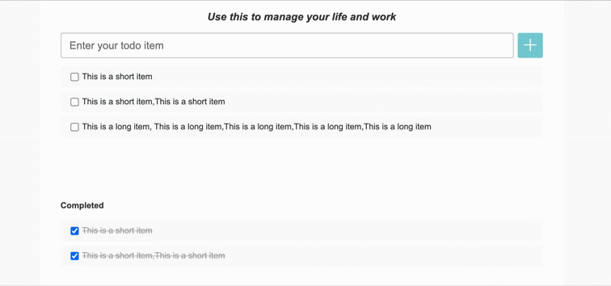

# 需求说明

### Story 1 显示 Item 列表

作为一个用户，我应当能看到已经添加过的 Item。包括 TODO 列表和 Completed 列表。  
若 Items 较多，则会出现纵向滚动条。 效果如下：

### Story 2 添加 Item

作为一个用户，我应当能够添加 Item。这样我就可以创建待办事项列表了。

#### AC 1 添加 Item

* 我应当能够在输入框（就是 Enter you todo item 那个输入框）中输入 TODO item 的内容（内容为纯文本）。
* 当我输入完毕之后，点击 “+” 按钮就可以在 TODO item 列表中第一个位置添加一个新的 item，且它的文本应该和我输入的文本一致。
* 当新的 item 添加完毕之后，应当清空输入框中的文字。

#### AC 2 避免开头和结尾的空格

* 当我输入的文本含有开头和结尾的空白字符的时候，在添加过程中应当去掉这些空白字符。例如我输入 “  Good  ”，则最终添加的内容应当是 “Good”。空白字符以 `String.prototype.trim` 的默认情况为准。

#### AC 3 错误检查

* 当我输入的文本为空文本时，或我输入的文本全部为空白字符的时候。应当显示一个错误消息：“Please input something first.”
* 错误消息的应当在 Enter your todo item 下方。
* 但是当我成功的添加了一个 Item 之后，错误信息应当消失。

### Story 3 删除待办事项

#### AC 1 删除未完成的 TODO item

* 当鼠标放在 TODO item 上时，显示"删除"按钮，点击"删除"按钮，该条 TODO item 从列表消失。

#### AC 1 删除已完成的 TODO item

* 当鼠标放在 Completed TODO item 上时，显示"删除"按钮，点击"删除"按钮，该条 TODO item 从列表消失。

### Story 4 标记完成状态

作为一个用户，我希望更明显的显示一个 TODO item 是否已经完成。这样我更容易看清整体的任务情况。

#### AC 1 完成状态的显示与切换

* 当一个 TODO item 被标记为完成状态（checkbox 被勾选）的时候，TODO item 应该从 TODO List 移除，并且出现在 Completed List。
* 当一个 TODO item 被重新激活（checkbox 取消勾选）的时候，TODO item 应该从 Completed List 移除，并且出现在 TODO List。

### Story 5 修改 Item 内容

作为一个用户，我可以修改已经创建的 Item 内容。

#### AC 1 编辑完成

* 当鼠标点击 Item 内容区域，显示 input 输入框，自动focus，placeholder 为当前内容，用户可以输入新的内容，按 "回车键"，修改成功，显示新的内容，输入框消失。

#### AC 1 取消编辑

* 当鼠标点击 Item 内容区域，显示 input 输入框，自动focus，点击其他地方，输入框消失，原来 Item 内容不变。

